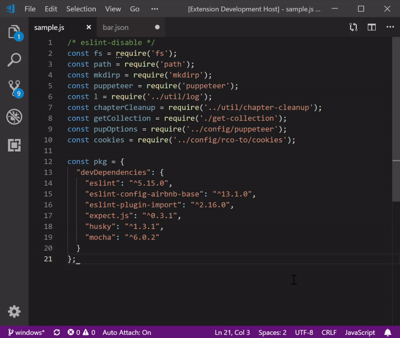
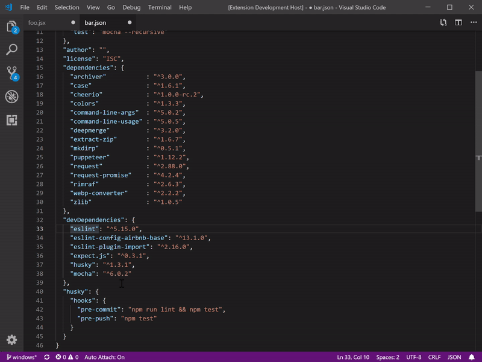

# readable-indent README

Indents imports, KVPs (like object literals) with a pivot point, padding whitespace for easy scanability.

## Features

Simple indentation will make your code easier to visually scan.  This extension will indent two common patterns on a pivot character:  `=` or  `:`

When applying readable-indent, use the pattern that makes the code snippet most readable:
### Left-justified readable-indent

### Center-justified readable-indent

## Usage
1. Select code snippet to make readable.
2. Use context menu (right|ctrl click) or key mapping to apply readable-indent
  * left-justfied indent: `ctrl-i ctrl-a`
  * center-justified indent: `ctrl-shift-b`

## Extension Settings

This extension contributes the following settings:

* `readableIndent.alphabetize`: set to `true` to alpha-order the snippet being readble-indented

## Known Issues

Due to conflicting prioritization of whitespace between left & center-justified readable-indentation, toggling between the two will incrementally further indent the snippet.  The workaround is to undo the readable-indent before trying the other.

Readable indent will use the first found instance of a pivot char (`=` or `:`).  In some sequences, this is incorrect.
TODO: detect if first found instance is in a sub-scope of the string (quotes, parens, etc.)

Obviously this indentation is conflicted with OOTB rules for `prettier`.  Pedagogy is out of scope for this extension ;).

## Release Notes

### < 0.1.0

* POC
* Documentation
* tests

### 0.1.0

Initial release on VSCE, dogfooding.
