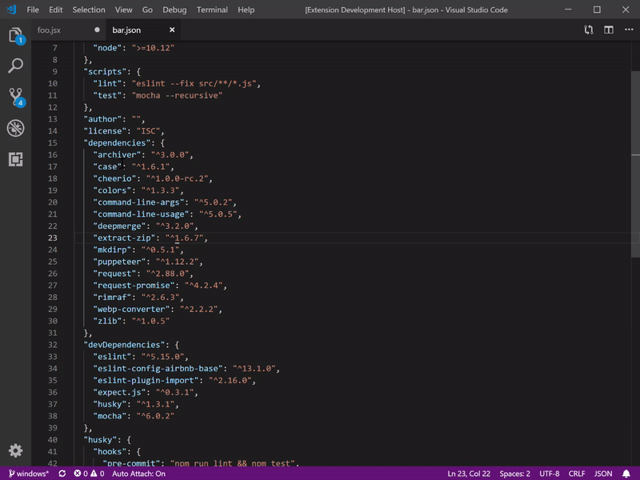
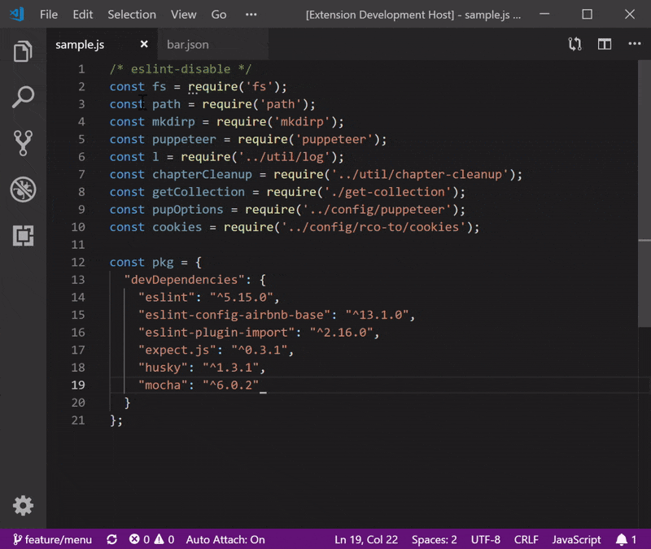
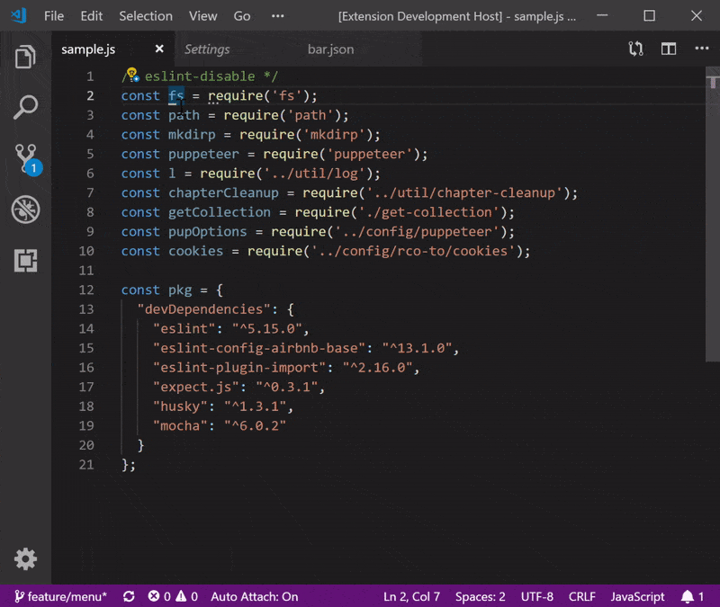
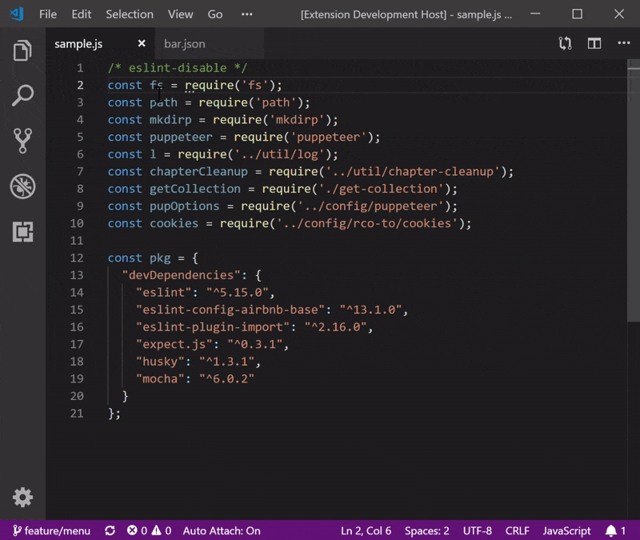

[](http://commitizen.github.io/cz-cli/)

# Readable Indent VS Code Extension

Indents imports, KVPs (like object literals) with a pivot point, padding whitespace for easy scanability.


## Features

Simple indentation will make your code easier to visually scan.  This extension will indent two common patterns on a pivot character:  **`=`** or  **`:`**

When applying readable-indent, use the pattern that makes the code snippet most readable:

### Left-justified readable-indent


### Left-justified, alphabetized readable-indent


### Center-justified readable-indent


### Center-justified, alphabetized readable-indent


## Usage
1. Select code snippet to make readable.
2. Use context menu (right|ctrl click) or key mapping to apply readable-indent

|                              	| Mac OSX             	| Windows/Linux         	|
|------------------------------	|---------------------	|-----------------------	|
| Indent                       	| `cmd-i cmd-a`       	| `ctrl-i ctrl-a`       	|
| Indent Alphabetized          	| `cmd-i cmd-shift-a` 	| `ctrl-i ctrl-shift-a` 	|
| Indent Centered              	| `cmd-i cmd-b`       	| `ctrl-i ctrl-b`       	|
| Indent Centered Alphabetized 	| `cmd-i cmd-shift-b` 	| `ctrl-i ctrl-shift-b` 	|

## VS Code Configuration

#### Minimum Whitespace Before Pivot (Left-justfied Indent only)

Readable Indent adds a simple configuration to set a minimum whitespace gap from the start of the `key` to the pivot character.  E.g.:
```json
{
  "a": "foo",
  "bc": "bar"
}
```
With a setting of `10`, the above will be indented as:
```json
{
  "a"      : "foo",
  "bc"     : "bar"
}
```

## Known Issues

Obviously this indentation is conflicted with OOTB rules for `prettier`.  Pedagogy is out of scope for this extension ;).

## Release Notes

[See CHANGELOG for details](./CHANGELOG.md)